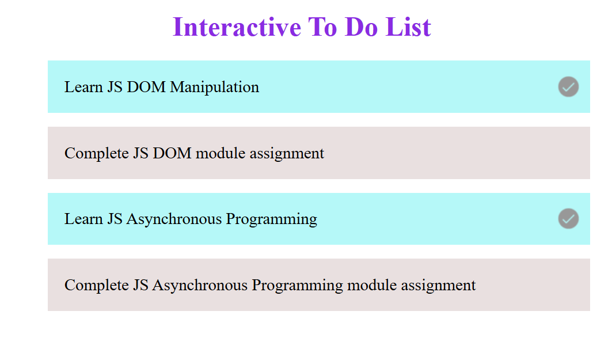
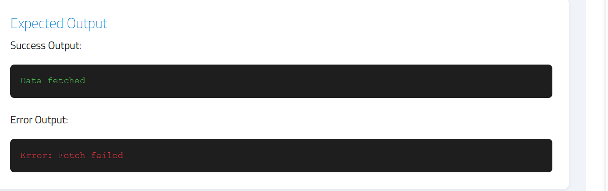

# JavaScript DOM & Async Module

This module focuses on building interactive web applications using **JavaScript DOM manipulation** and handling **asynchronous operations** with **Callbacks** and **Error Handling**.

---

##  Assignments Overview
### 1. [Build a Simple Interactive To-Do List](#1-build-a-simple-interactive-to-do-list)
### 2. [Callback Function Assignment: Async Data Fetching with Error Handling](#2-callback-function-assignment-async-data-fetching-with-error-handling)

---

## 1️ Simple Interactive To-Do List

### 🛠️ Steps Implemented:
1. Added a heading using `<h1>` with the text: **“Interactive To-Do List”**.
2. Created a task list using the `<ul>` element containing `<li>` to-do items.
3. Assigned a **default color** (e.g., gray) to all list items via CSS.
4. Added a **tick/check icon** aligned to the right of each list item.
   - The icon should be **hidden by default**.
5. Implemented a **click event handler** that:
   - Changes the color of the clicked task (e.g., to green or blue).
   - Makes the tick icon **visible** to indicate task completion.
   - Allows toggling between **completed** and **incomplete** states.

## 2️ Callback Function Assignment — Async Data Fetching with Error Handling

### Task Breakdown:
#### Part 1: `fetchDataWithCallback` Function
- Accepts a **callback function** as a parameter.
- Uses `setTimeout` with a **2-second delay**.
- After 2 seconds, call the callback function with the message: `"Data fetched"`.
- Display the result using `console.log()`.

#### Part 2: Error Handling
- Simulate an error condition using a variable (e.g., `let error = true`).
- Wrap the logic inside a **try/catch** block.
- If there's an error:
  - Log: `Error: Fetch failed` using `console.error()`.
- If successful:
  - Call the callback with `"Data fetched"`.

